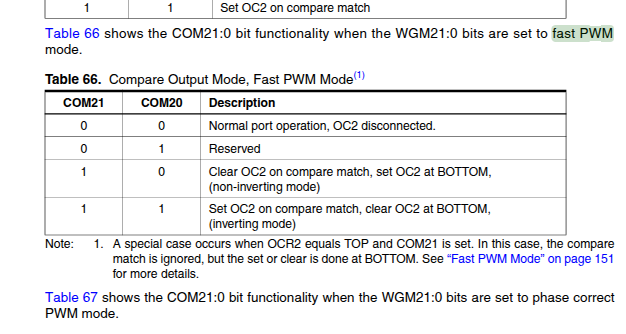
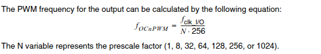
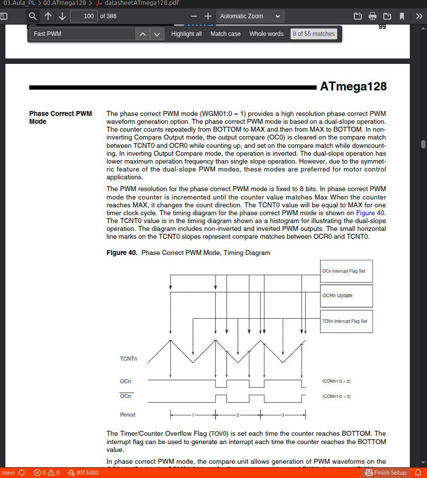
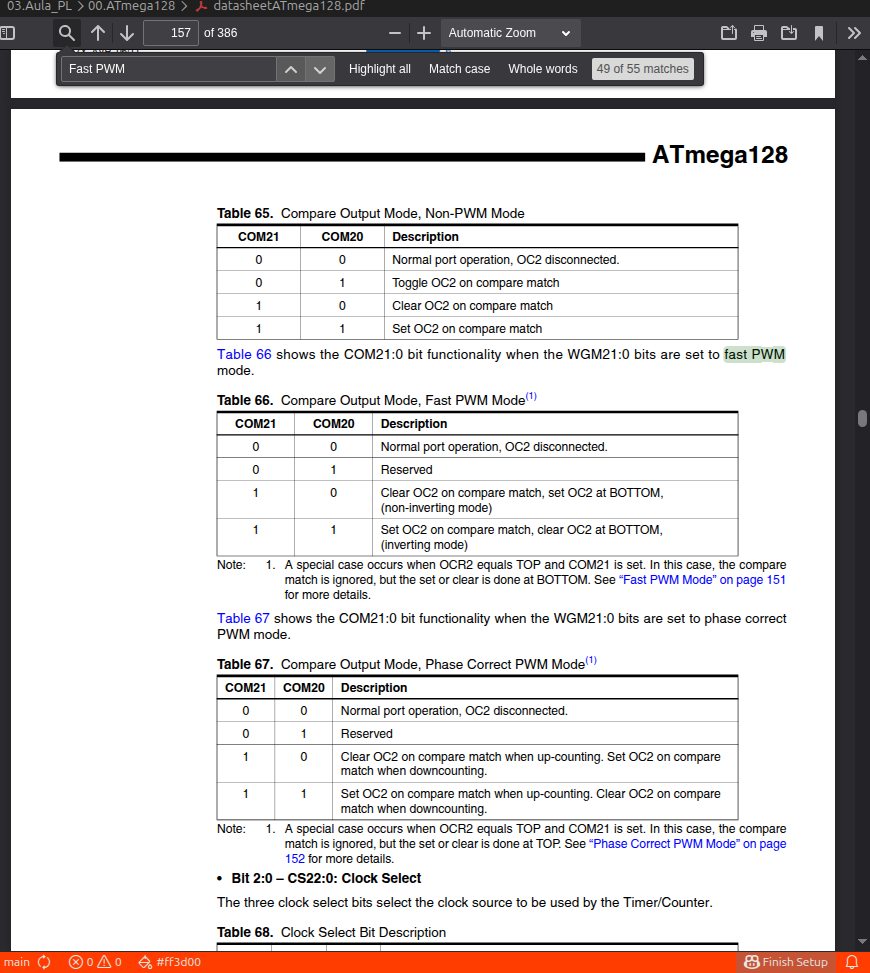
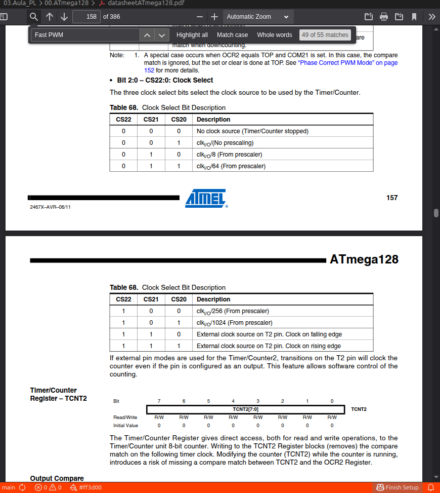
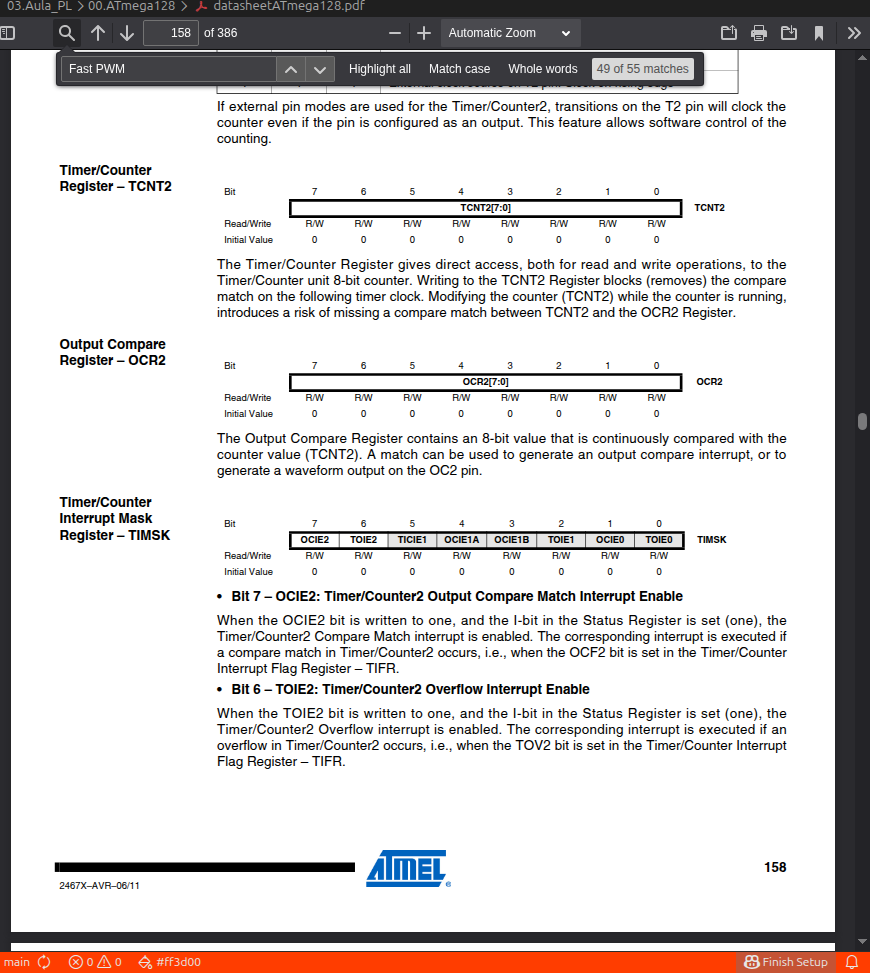
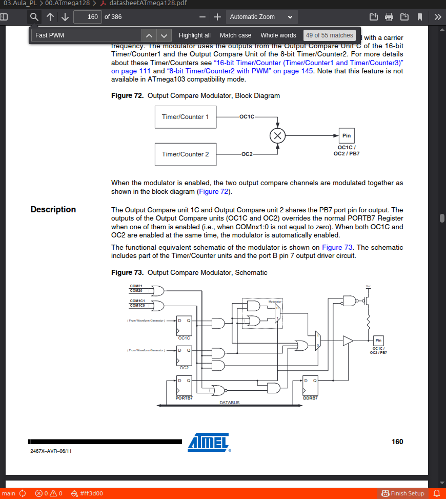
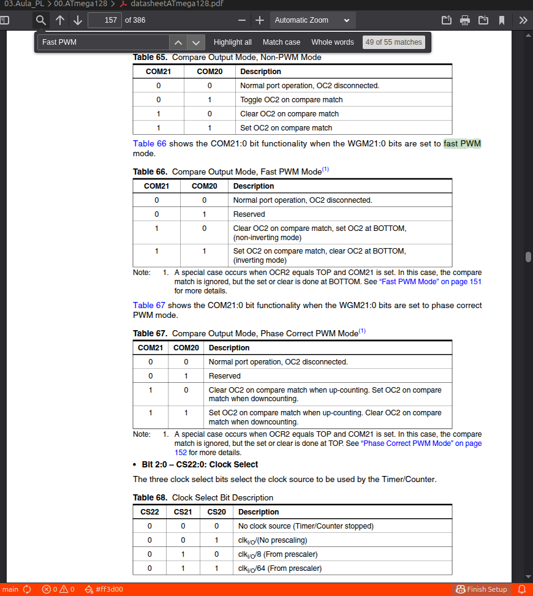

Vamos ao datasheet do ATmega 128 e encontra:
    > seccao do timer2 -> Fast PWM -> formula da frequencia.

pelo que estou a ver 

THE PWM frequency for the output can be calculated by the following equation: 

fOCNPWM = fclk_I/O / N * 256

this if we do correctly for the motors as phase correct mode 

    

