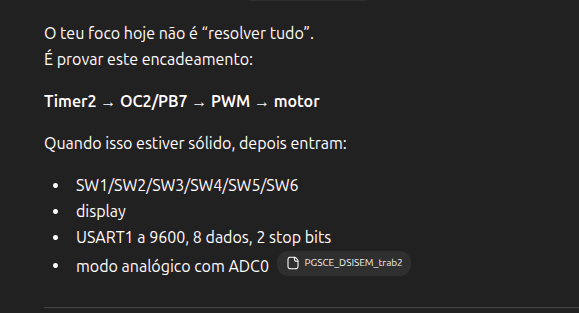
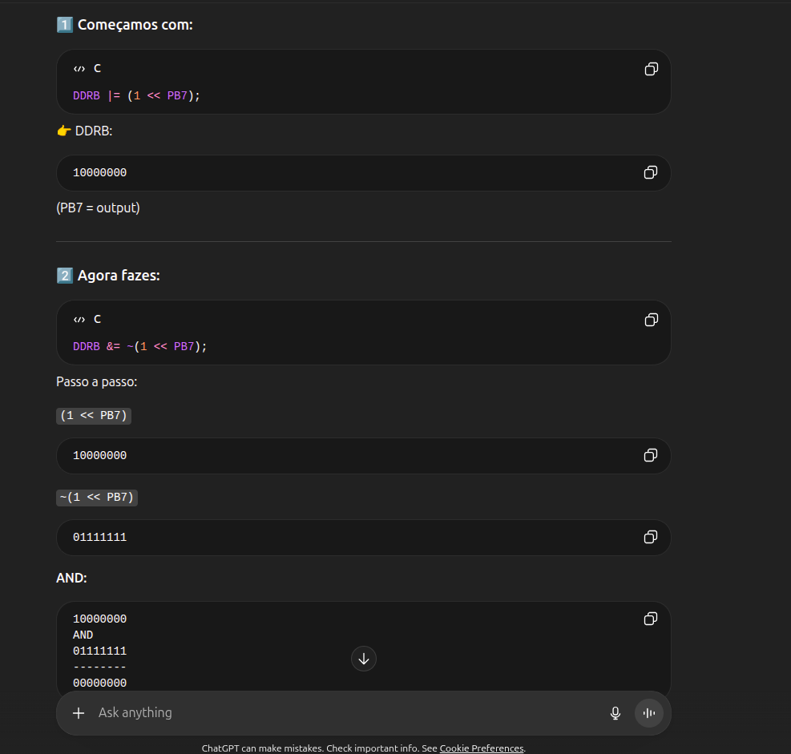
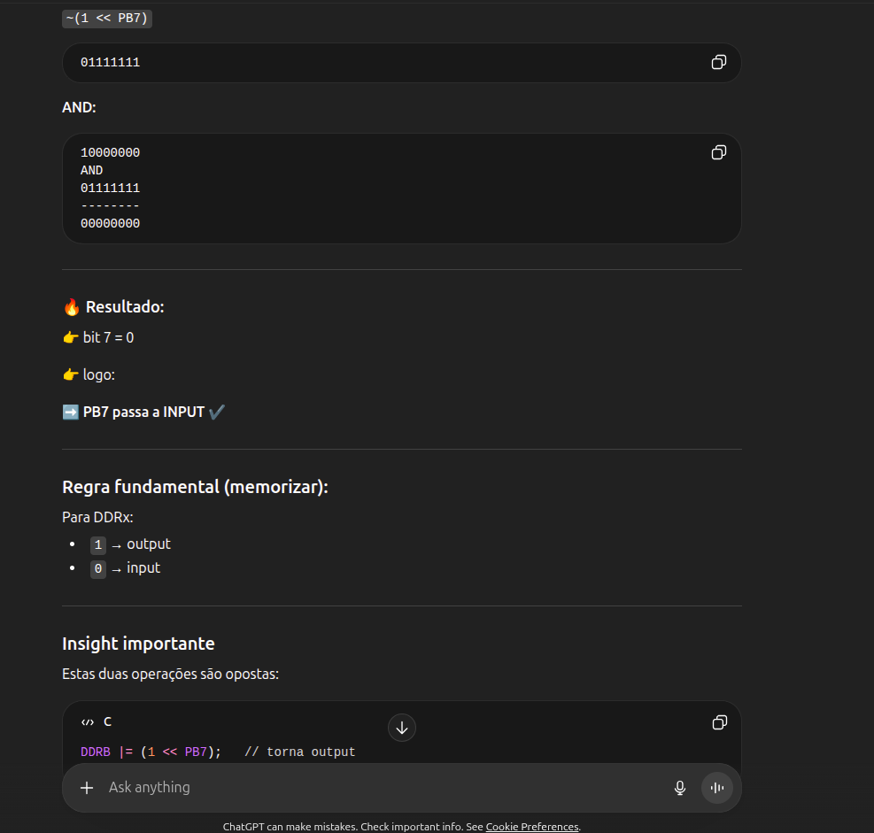
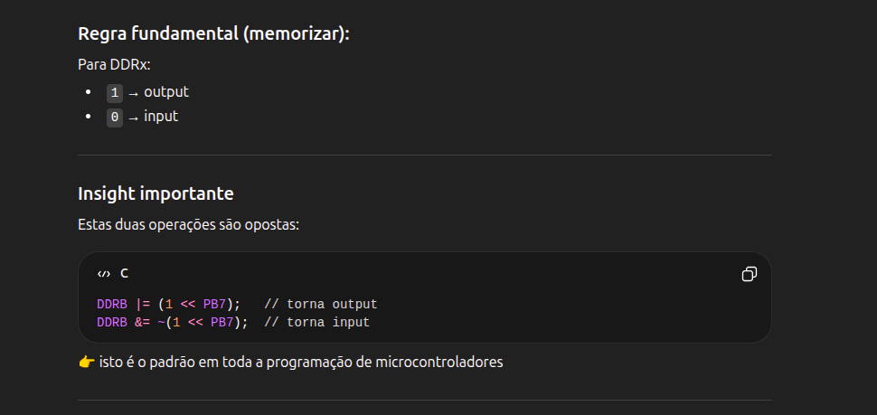
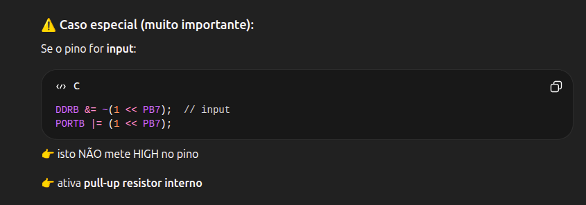
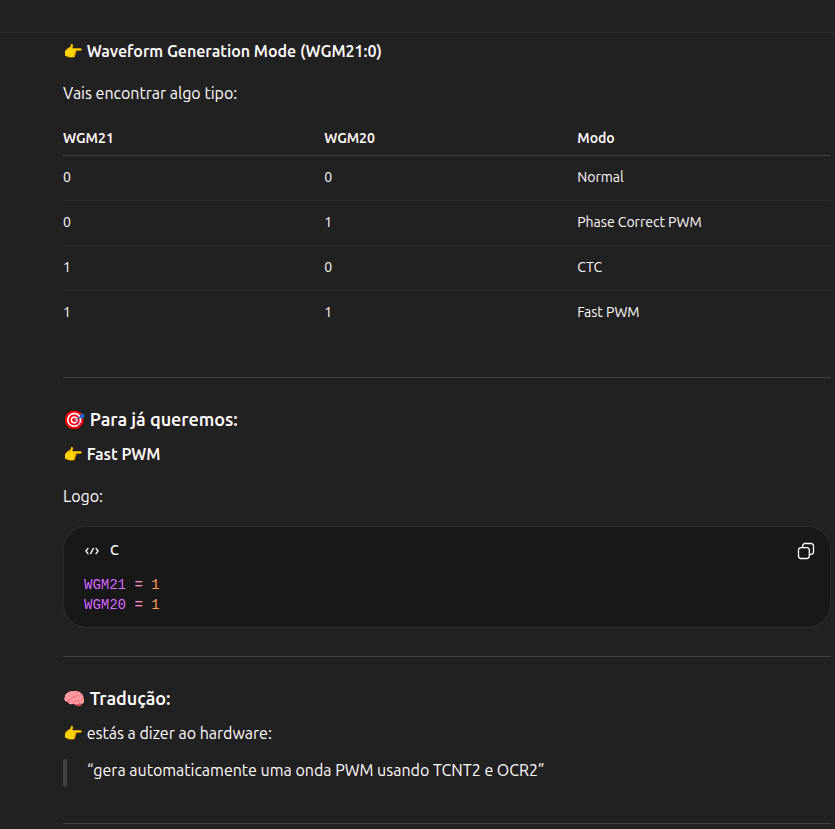
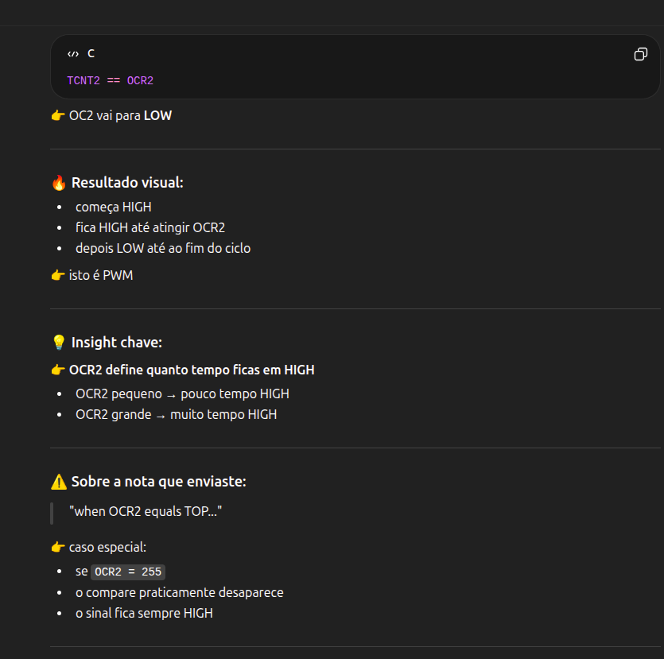

Fast Pwm vs Phase Correct
    Phase Correct -> mais simetrico -> melhor para motores.
    Fast PWM -> mais simples -> melhor para comecar
Primeiro fast PWM

focar :

    > TCNT
    > OCR
    > COM bits

OC2 e:

    > OUtput compare 2
    > ligado fisicamente a um pino do microcontrolador

No enunciado

    PWM - PB7

logo:

    OC2 = PB7

    Prescaler :
        divide o clock (16mhz)
        controla frequencia

    ex:
        16 MHz / 128 = 125 kHz
    
**OCR2**

    . Nao define duty cycle
    . Nao afeta frequencia directamente

*Frequencia do PWM*

    f_PWM = f_clk / (N * 256)

Aqui: 

    n = prescaler
    256 = contador (0 -> 255)

**IMPORTANTE**

    PERGUNTA

    Importante

    PULL UP 

o tipo de onda (PWM) e definido pelos bits WGM, nao pelo OCR nem pelo prescaler. 

WGM21:0 wve generation mode.

